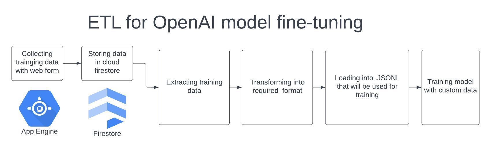

### Fine-tuning LLM model

- Create a project or select existing
- Enable App Engine and Firestore API's
- Create Firestore database
- Create bucket for the training data:

`gsutil mb -l us-central1 gs://fine-tuning-training-data`

- Run `pip install -r requirements. txt`
- Run `gcloud app create`
- Run `gcloud app deploy`
- To create a cloud function for extracting the training data and transforming in to .jsonl file, inside the /cloudfunction dir run:

`gcloud functions deploy export_to_storage --runtime python39 --trigger-http --region us-central1 --entry-point export_to_storage --allow-unauthenticated --timeout 540s --memory 128MB`

- Test cloud function with:

`curl -m 550 -X POST https://us-central1-YOUR_PROJECT_ID_HERE.cloudfunctions.net/export_to_storage \
-H "Authorization: bearer $(gcloud auth print-identity-token)" \
-H "Content-Type: application/json" \
-d '{}'` dont forget to set your project id./

## TODO

- Train the model at OpenAI API with custom data
- Build the full pipeline on the cloud

\*maybe some instructions are missing
